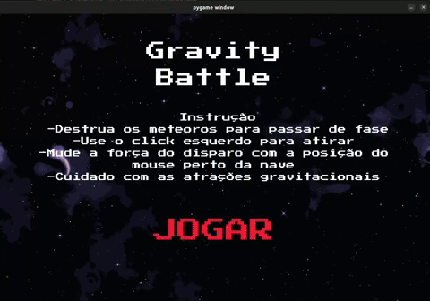

# aps-1-caio

integrantes:
Caio Frigerio Liberal(Caiolib)

# COMO INSTALAR O JOGO

- Para jogar o jogo é necessário ter o python instalado na maquina, caso não tenha, baixe o python em https://www.python.org/downloads/
- Installe o arquivo zip no GitHub
- Para jogar o jogo precisa baixar o requirements.txt com o pip, apos isso só executar o arquivo app.py (pip install -r requirements.txt)
- Acesse a pasta do jogo instalado com o comando "cd" no terminal
- Use o comando "python app.py" ou "python3 app.py"

# COMO JOGAR 
- O objetivo do jogo é acertar com os Angrybrid todos os meteoros da tela. 
- Utilize o botão esquerdo do mouse para atirar, apenas é possivel atirar de novo quando seu tiro atingir algum objeto ou sair da tela.
- Quando todos os asteroides da fase forem destruidos, a proxima fase se inicia automaticamente.
- As forças gravitacionais dos planetas e estrelas dificultam o acerto dos meteoros.

# DESCRIÇÃO MATEMATICA DO JOGO

- A física gravitacional dos planetas se baseia na formula de Força Gravitacional, definida por Fg = (M*m*G)/d**2, e é definida dentro da função "calcular_gravidade_planeta". Como o jogo não implica as massas dos planetas ou do tiro e G é uma constante, podemos considerar (M*m*G) como uma constante. Para tanto, calculamos essa constante multiplicando o raio do planeta (ou estrela) por uma constante x. Essa constante x foi escolhida para melhor adequar a força gravitacional dos planetas no jogo. Ademais, calculamos nossa distancia como a diferença da posição do disparo(Angrybird) e do planeta. Essa função retorna a força gravitacional calculada a partir dos parametros a cima vezes sua direção, para que o objeto vá para a direção correta a qual o mesma está apontando. A direção é calculada pela normalização do vetor de distancia, esse vetor é dividido por ele mesmo para adiquirimos apenas para aonde o planeta aponta para o angrybird. Foi utilizado a direção negativa nessa multiplicação pois, ela calcula a direção do objeto para o planeta e queremos que o objeto aponte para o planeta, ou seja o inverso da direção calculada.
- A física gravitacional das estrelas foi abordada na função "calcular_gravidade_estrela". Calculamos a força gravitacional igual na função "calcular_gravidade_planeta" mas, trocamos a direção que o objeto vai, diferentimente da outra função, nao negativamos a direção no final. Dessa forma, ao invez da objeto (o Angrybird) ser atraido pelo planeta, ele é repelida. Para tanto, foi criada uma feature a mais no jogo, que muda a física padrão do mesmo.
- A velocidade da objeto é dada a partir da multiplicação da Força gravitacional aplicada pelo planeta ou estrela vezes o tempo (que é definido pelo fps do jogo)

# REFERENCIAS DO JOGO

- Auxilo do chat gpt para a criação da função "load_images()" e como usa-la no arquivo principal
- Musica de fundo disponivel no link "https://www.youtube.com/watch?v=R6EI0Bs5p0M&ab_channel=presstoexit"
- Efeitos sonoros do site "https://freesound.org/"
- Imagens pegas do site "https://itch.io/"